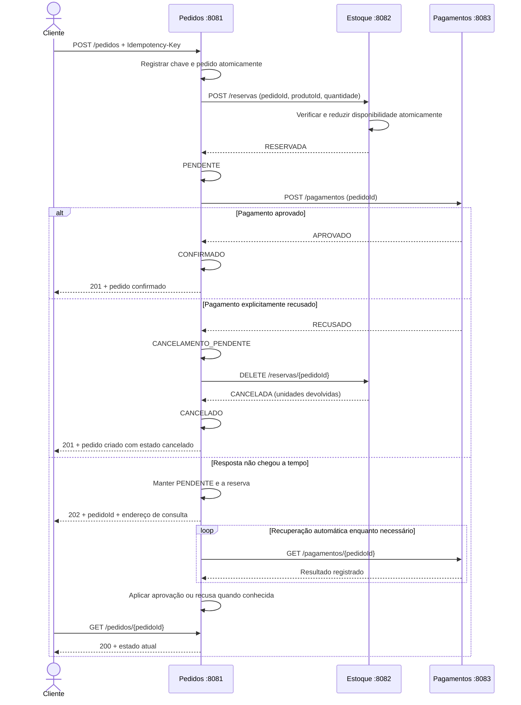

# Checkout Kipper

Três serviços Java/Spring Boot com dados em memória e pagamento simulado.
O estudante decide a arquitetura; o assistente implementa, testa e discute as
consequências das decisões. Este projeto foi gerado no Spring Initializr.

## Testar pelo navegador

Clone o repositório e inicie o laboratório:

```sh
git clone https://github.com/jvcorado/checkout-kipper.git
cd checkout-kipper
python3 laboratorio/servidor.py
```

Se você já clonou o projeto, basta executar o último comando na pasta
`checkout-kipper`. O comando do laboratório funciona em macOS e Linux; no Windows,
use WSL ou compile os três serviços com `mvnw.cmd` antes de iniciar o laboratório
com `python laboratorio/servidor.py --sem-build`.

Abra **[http://localhost:8080](http://localhost:8080)**. O inicializador compila
os projetos quando necessário e inicia Pedidos, Estoque e Pagamentos. É preciso
ter Java 21 e Python 3 instalados e as portas 8080–8083 livres. Não inicie os
serviços separadamente ao usar o laboratório. `Ctrl+C` encerra os três processos
criados por ele.

O painel oferece **16 cenários**, controles de falhas, envio manual de pedidos,
repetição de chave, comparação dos estados dos três serviços e histórico das
chamadas HTTP. Cada cenário começa com 10 unidades. **Normalizar serviços** remove
as falhas sem apagar os pedidos; **Reiniciar laboratório** apaga os dados em
memória dos três serviços. Exporte as evidências antes de reiniciar se quiser
guardá-las para a discussão de arquitetura.

Os pedidos, reservas e cobranças vêm dos serviços Java reais. Uma camada local
controla o atraso das respostas e as falhas HTTP; o pagamento continua simulado.
Veja o [guia do laboratório e os resultados esperados](laboratorio/README.md).

## Escolha de arquitetura

**Orquestração com HTTP, coordenada por Pedidos.** Cada serviço mantém seus
próprios dados e oferece operações por API. Pedidos não acessa a memória interna
de Estoque nem de Pagamentos.

A justificativa do estudante, após a discussão, é a simplicidade de projetar o
checkout sem mensageria ou filas. Em troca, ele aceita esperar as respostas dos
serviços e tratar os casos em que uma resposta não chega. O timeout limita a
espera, mas não revela o resultado nem resolve sozinho uma falha.

- **Benefício:** começar com três aplicações e chamadas HTTP diretas, sem instalar
  um broker; a sequência de reserva, cobrança e eventual devolução fica explícita
  no coordenador.
- **Custo:** Pedidos precisa administrar espera, indisponibilidade, timeout e
  recuperação. Neste projeto, isso exige guardar o estado e consultar as operações
  remotas quando a resposta não chega. O custo das chamadas se acumula no fluxo.
- **Alternativa escolhida pelo estudante para comparação:** orquestração por mensagens.
  Pedidos continuaria como coordenador e enviaria
  comandos de reserva e cobrança pelo broker e receberia resultados correlacionados.
  Mensagens duráveis poderiam aguardar consumidores indisponíveis, mas seria
  necessário operar o broker e tratar entrega repetida, publicação e consumo.
  Recebimento da mensagem pelo broker continuaria sem significar conclusão do pedido.

HTTP também permite responder que uma operação está pendente. Aqui a primeira
requisição tenta concluir o fluxo; um resultado desconhecido recebe `202` e é
recuperado em segundo plano. A escolha por HTTP não elimina essa possibilidade.

## Decisões tomadas durante o exercício

| Tema | Decisão |
| --- | --- |
| Fluxo principal | Reservar estoque, deixar pedido pendente e cobrar; confirmar após aprovação |
| Reserva | Estoque verifica e desconta a quantidade disponível em uma operação atômica |
| Recusa explícita do pagamento | Devolver a reserva e cancelar o pedido |
| Timeout | Resultado desconhecido; não cancelar nem liberar estoque automaticamente |
| Recuperação | Pedidos consulta o resultado automaticamente em intervalos |
| Mesma compra reenviada | Mesma chave de idempotência, mesmo pedido |
| Repetição em andamento | Informar o pedido existente e seu estado sem iniciar outra execução |
| Mesma chave com dados diferentes | Rejeitar a alteração e preservar o pedido original |
| Outra compra legítima | Usar outra chave, mesmo que produto e quantidade sejam iguais |
| Alternativa à implementação HTTP | Orquestração por mensagens, mantendo Pedidos como coordenador |

A escolha, a alternativa, o benefício e o custo foram registrados com o estudante.
As regras do checkout estão implementadas com HTTP; a alternativa por mensagens
foi documentada para comparação e não exige instalar um broker neste projeto.

### Comparação com a alternativa

| Aspecto | HTTP implementado | Orquestração por mensagens |
| --- | --- | --- |
| Quem decide a sequência | Pedidos | Pedidos |
| Como solicita trabalho | Chamadas às APIs de Estoque e Pagamentos | Comandos publicados para os serviços pelo broker |
| Como conhece o resultado | Resposta HTTP ou consulta posterior por identificador | Mensagens de resultado correlacionadas ao pedido |
| Consumidor indisponível | Pedidos mantém estado e faz recuperação por HTTP | Com persistência e confirmações adequadas, o broker pode guardar trabalho até o consumidor voltar |
| Custo adicional | Timeouts, consultas e dependência das chamadas diretas | Operação do broker, publicação confiável e tratamento de entregas repetidas |

Na alternativa, depois de receber o resultado da reserva, Pedidos enviaria
`CobrarPagamento` com o identificador do pedido. O serviço Pagamentos informaria
o resultado, como `PagamentoAprovado` ou `PagamentoRecusado`. Pedidos continuaria
responsável por confirmar o pedido ou solicitar a compensação da reserva.
Idempotência e correlação continuariam necessárias. A confirmação do broker
se refere à mensagem e não substitui o resultado de negócio de Pagamentos.

## Fluxo



O cenário de falta de estoque termina como `RECUSADO`, sem cobrar. Se a devolução
não for confirmada, o pedido permanece `CANCELAMENTO_PENDENTE` e a recuperação tenta
novamente. Só informamos `CANCELADO` depois que Estoque confirma a compensação.

## Executar

Requisitos: **JDK 21** e acesso à internet para baixar as dependências na primeira
execução. São três projetos Maven separados, com **Spring Boot 4.1.1**, Spring Web
(`spring-boot-starter-webmvc`) e Maven Wrapper. Não é necessário instalar Maven.

Abra três terminais na pasta `checkout-kipper` e execute um bloco em cada um:

```sh
cd estoque
./mvnw spring-boot:run
```

```sh
cd pagamentos
./mvnw spring-boot:run
```

```sh
cd pedidos
./mvnw spring-boot:run
```

| Serviço | Endereço local |
| --- | --- |
| Pedidos | http://localhost:8081 |
| Estoque | http://localhost:8082 |
| Pagamentos | http://localhost:8083 |

No Windows, use `mvnw.cmd`. Os serviços escutam apenas em `127.0.0.1`. A raiz `/`
retorna 404; use os endpoints abaixo. Encerre os processos com `Ctrl+C`.

### Primeira compra

Estoque inicia com **10 unidades de `produto-1`**:

```sh
curl -i http://localhost:8081/pedidos \
  -H 'Content-Type: application/json' \
  -H 'Idempotency-Key: compra-A' \
  -d '{"produtoId":"produto-1","quantidade":2}'
```

O resultado padrão é `201 Created`, com `status: CONFIRMADO`, `pedidoId` e o
cabeçalho `Location: /pedidos/{pedidoId}`. O saldo passa de 10 para 8.

```sh
curl http://localhost:8082/estoque/produto-1
```

Repita a compra com a mesma chave e os mesmos dados: a resposta mostra o mesmo
pedido, sem descontar ou cobrar novamente. Uma segunda compra legítima precisa de
outra chave. Reutilizar `compra-A` mudando a quantidade para 5 retorna 409.

Para consultar o resultado, substitua o identificador retornado:

```sh
curl http://localhost:8081/pedidos/COLE_O_PEDIDO_ID
curl http://localhost:8083/pagamentos/COLE_O_PEDIDO_ID
```

### Simular recusa ou resposta atrasada

Para começar cada cenário do zero, encerre e reinicie os três serviços. No terminal
de Pagamentos, use um dos comandos abaixo em vez da inicialização padrão:

```sh
PAGAMENTO_RESULTADO=RECUSADO ./mvnw spring-boot:run
```

A nova compra será criada com estado `CANCELADO`, e o saldo voltará a 10 após a
devolução. A recusa é um resultado de negócio, não um erro de comunicação.

```sh
PAGAMENTO_ATRASO_RESPOSTA_MS=5000 ./mvnw spring-boot:run
```

O resultado é registrado antes do atraso de cinco segundos na resposta do POST.
Pedidos espera até dois segundos pela resposta, devolve o pedido pendente e depois
consulta o resultado automaticamente. O GET de Pagamentos não tem esse atraso.
Consulte o pedido até observar `CONFIRMADO`; o saldo deve continuar em 8.

Também é possível iniciar somente Estoque e Pedidos, fazer uma compra e iniciar
Pagamentos depois. O pedido fica pendente até o serviço estar disponível e a
recuperação concluir a operação.

## Contratos

### Pedidos

`POST /pedidos` exige `Idempotency-Key` com 1 a 128 caracteres e corpo JSON com
`produtoId` não vazio e `quantidade` inteira positiva. Chaves são comparadas
exatamente como recebidas. Neste exercício não há usuários nem autenticação.

| Situação | Resposta |
| --- | --- |
| Novo pedido que já chegou a `CONFIRMADO` ou `CANCELADO` | 201 + pedido |
| Repetição de pedido já confirmado/cancelado | 200 + mesmo pedido |
| Processamento ou recuperação em andamento, inclusive repetição | 202 + mesmo pedido, `Location` e `Retry-After: 2` |
| Mesma chave com produto/quantidade diferentes | 409 + erro |
| Produto inexistente ou reserva recusada pelo estoque | 409 + pedido com estado `RECUSADO` |
| Chave ausente/vazia, corpo inválido ou quantidade não positiva/fracionária | 400 |
| `GET /pedidos` | 200 + lista dos pedidos em memória para observação no painel |
| `GET /pedidos/{pedidoId}` | 200 + estado atual; 404 se não encontrado |

`201` significa que o recurso pedido foi criado. Confira o campo `status` para
saber se a compra foi confirmada ou cancelada. `202` significa aceite sem conclusão,
conforme a [semântica de HTTP 202](https://www.rfc-editor.org/rfc/rfc9110.html#name-202-accepted).

| Estado | Significado |
| --- | --- |
| `EM_PROCESSAMENTO` | Reserva em execução ou resultado da reserva ainda desconhecido |
| `PENDENTE` | Estoque reservado; pagamento em execução ou resultado ainda desconhecido |
| `CANCELAMENTO_PENDENTE` | Pagamento recusado; falta confirmar a devolução ao estoque |
| `CONFIRMADO` | Reserva efetuada e pagamento aprovado |
| `CANCELADO` | Reserva cancelada; no fluxo de recusa, compensação confirmada |
| `RECUSADO` | Estoque rejeitou a solicitação; não houve cobrança |

### Estoque

| Operação | Resultado |
| --- | --- |
| `GET /estoque/{produtoId}` | `produtoId` e `disponivel`; 404 se produto inexistente |
| `GET /reservas` | 200 + lista das reservas em memória |
| `POST /reservas` | Recebe `pedidoId` (UUID), `produtoId`, `quantidade`; retorna 200 com reserva |
| `GET /reservas/{pedidoId}` | Reserva e status `RESERVADA` ou `CANCELADA`; 404 se inexistente |
| `DELETE /reservas/{pedidoId}` | Devolve unidades e retorna 200 com status `CANCELADA`; 404 se inexistente |

Verificar, descontar e registrar usam o mesmo bloqueio dentro da instância. Repetir
uma reserva com o mesmo `pedidoId` e os mesmos dados não desconta novamente. Usar o
mesmo ID com outros dados, tentar reativar reserva cancelada ou pedir mais que o
saldo retorna 409. Repetir a devolução não aumenta o saldo novamente.

### Pagamentos

| Operação | Resultado |
| --- | --- |
| `POST /pagamentos` | Recebe `pedidoId` (UUID); retorna 200 com `pagamentoId`, `pedidoId` e `status` |
| `GET /pagamentos` | 200 + lista das cobranças em memória |
| `GET /pagamentos/{pedidoId}` | Resultado registrado; 404 quando ainda não há registro |

A simulação devolve `APROVADO` ou `RECUSADO`. O mesmo `pedidoId` preserva a mesma
cobrança e seu resultado, inclusive sob concorrência. Não recebe cartão, não
calcula preços e não movimenta dinheiro.

## Idempotência e recuperação

A chave enviada pelo cliente identifica uma intenção de compra. Pedidos associa
essa chave a um único `pedidoId` **antes** das chamadas externas, de forma atômica.
Esse ID é a chave interna da reserva e da cobrança. Nenhum ID é recriado durante
uma tentativa de recuperação da mesma operação.

Uma repetição em andamento apenas lê o pedido existente e retorna 202. A primeira
execução ou a recuperação automática continuam trabalhando. Um controle por pedido
impede que duas execuções avancem simultaneamente nas etapas.

A recuperação consulta primeiro o serviço cujo resultado ficou desconhecido. Se a
consulta retorna 404, repete a mesma operação com o mesmo identificador. Um 404 não
é interpretado como uma recusa da cobrança. A idempotência no serviço receptor é
necessária também nesse reenvio, pois a solicitação original pode estar a caminho.

O agendamento percorre os pedidos pendentes e espera dois segundos após terminar
uma rodada antes da próxima. `GET /pedidos/{pedidoId}` apenas consulta o estado;
não dispara cobrança nem recuperação.

| Configuração | Serviço | Padrão |
| --- | --- | --- |
| `ESTOQUE_URL` | Pedidos | `http://127.0.0.1:8082` |
| `PAGAMENTOS_URL` | Pedidos | `http://127.0.0.1:8083` |
| `SERVICOS_TIMEOUT_MS` | Pedidos | `2000` para conexão e leitura |
| `RECUPERACAO_INTERVALO_MS` | Pedidos | `2000` |
| `RECUPERACAO_AUTOMATICA` | Pedidos | `true` |
| `PAGAMENTO_RESULTADO` | Pagamentos | `APROVADO` ou `RECUSADO`; padrão `APROVADO` |
| `PAGAMENTO_ATRASO_RESPOSTA_MS` | Pagamentos | `0` |

## Verificar

Em cada uma das três pastas, compile e execute os testes:

```sh
./mvnw verify
```

Existem 31 testes Java: 13 em Pedidos, 10 em Estoque e 8 em Pagamentos. Eles cobrem
inicialização, fluxo e ordem das chamadas, recusa, timeout, recuperação,
compensação, conflitos e concorrência. O teste de estoque disputa 10 unidades com
30 solicitações; o de Pagamentos envia 30 cobranças simultâneas para o mesmo pedido.
O teste de repetição em Pedidos mantém a primeira cobrança em andamento e verifica
que a segunda chamada retorna 202 sem esperar nem duplicar os efeitos.

Com os JARs compilados, Python 3 instalado e as portas 8081–8083 livres, execute a
partir de `checkout-kipper`:

```sh
python3 scripts/verificar_http.py
```

O script inicia os JARs reais, verifica a comunicação HTTP e encerra apenas os
processos que ele próprio iniciou. Cobre sucesso, repetição, conflito, validação,
falta de estoque, recusa com compensação, timeout com recuperação e indisponibilidade
seguida de inicialização de cada dependência. Ele não reutiliza serviços que já
estavam rodando, pois os cenários pressupõem memória inicialmente vazia.

Validação realizada em 30/09/2026: os 31 testes Java passaram. A verificação HTTP
original passou em cinco grupos; o laboratório acrescentou 12 grupos de cenários
HTTP com os serviços reais e oito grupos de comportamento da interface em DOM
local. Os comandos e o alcance dessas verificações estão no
[guia do laboratório](laboratorio/README.md#verificação).

## Limites deste checkpoint

- Dados, associações das chaves e resultados existem apenas em memória. Reiniciar
  um serviço apaga seu estado e pode deixá-lo inconsistente com os outros; reinicie
  o trio para zerar o exercício. Não há garantia de idempotência após reinício.
- Cada serviço deve ter apenas uma instância. Os bloqueios e registros locais não
  coordenam múltiplas réplicas. Não há transação distribuída: a devolução é outra
  operação e também pode falhar.
- A recuperação é simples, sequencial e sem limite de tentativas. Se um serviço
  permanecer indisponível, o pedido fica pendente. Não há persistência, backoff,
  monitoramento operacional ou rotina de intervenção humana.
- O cancelamento implementado é a compensação de um pagamento recusado. Cancelamento
  voluntário de compra já aprovada, estorno, alteração de pedido e reserva com
  expiração não fazem parte deste exercício.

## Referências

- [Spring Initializr](https://start.spring.io/)
- [Requisitos do Spring Boot](https://docs.spring.io/spring-boot/4.1/system-requirements.html)
- [Cliente HTTP RestClient do Spring](https://docs.spring.io/spring-framework/reference/integration/rest-clients.html)
- [HTTP 202 Accepted](https://www.rfc-editor.org/rfc/rfc9110.html#name-202-accepted)
