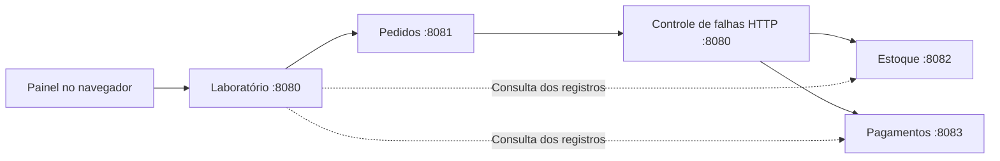

# Laboratório de checkout

Uma interface para testar as decisões do checkpoint com os três serviços Java.
O painel não inventa pedidos nem altera o saldo diretamente: ele envia chamadas
HTTP e consulta os registros de Pedidos, Estoque e Pagamentos.

## Iniciar

Na pasta `checkout-kipper`:

```sh
python3 laboratorio/servidor.py
```

Abra **[localhost:8080](http://localhost:8080)**. Aguarde a indicação
“3 serviços conectados”. Requer Java 21, Python 3 e portas 8080–8083 livres.
O Maven Wrapper compila os projetos quando os JARs estão ausentes ou desatualizados;
na primeira compilação, é necessário acesso à internet para baixar dependências.
O painel não precisa de Node, npm nem de um processo de compilação do front.

O inicializador recusa portas ocupadas e encerra somente os processos que criou.
Se você já iniciou os três serviços em outros terminais, encerre essas execuções
antes. `Ctrl+C` no terminal do laboratório encerra o painel e seus três serviços.
Falhas de inicialização ficam em `checkout-kipper/.laboratorio/*.log`.

## Como explorar

1. Escolha um cenário na lateral e clique em **Executar cenário**. Ele reinicia o
   trio e configura o experimento. Se houver dados, a tela solicita confirmação.
2. Compare os critérios de aceite, o saldo e os estados do pedido, da reserva e
   do pagamento. Um pedido ainda pendente pode ter uma reserva já concluída.
3. Abra as linhas do histórico para ver requisição, resposta, chave e duração.
   O histórico contém no máximo as últimas 400 chamadas do experimento.
4. Nos cenários de indisponibilidade ou devolução bloqueada, use **Normalizar
   serviços**. Os registros permanecem; Pedidos retoma o fluxo automaticamente.
5. Use **Exportar evidências** para salvar um JSON antes de reiniciar. Ele inclui
   os registros dos três serviços, a configuração e as chamadas observadas.

Para experimentar livremente, informe produto, quantidade e chave no formulário.
Reenvie a mesma chave para repetir uma intenção de compra; gere uma chave nova
para outra compra. A seção de validação permite omitir a chave ou disparar duas
requisições simultâneas. Alterar os dados mantendo a chave testa o conflito 409.

Depois de um cancelamento concluído, a inspeção do pedido oferece **Repetir
devolução (2×)**. Esse botão envia duas chamadas concorrentes para a mesma reserva.
Confira o saldo e o estado registrados, sem depender apenas do HTTP 200.

## Cenários e resultados esperados

Cada execução começa com 10 unidades de `produto-1`. Os resultados abaixo se
referem ao cenário isolado, antes de você adicionar outras compras ou falhas.

| Cenário | O que observar |
| --- | --- |
| Compra aprovada | 2 unidades reservadas, um pedido confirmado, uma cobrança aprovada, saldo 8 |
| Estoque insuficiente | Pedido de 11 unidades recusado com 409, saldo 10, nenhuma cobrança |
| Pagamento recusado | Pedido e reserva cancelados, cobrança recusada, saldo devolvido para 10 |
| Timeout no pagamento | Cobrança registrada antes do atraso; resposta 202, consulta automática e confirmação sem nova cobrança |
| Pagamentos indisponível | HTTP 503 simulado, pedido pendente e saldo 8; normalizar permite cobrar e confirmar |
| Estoque indisponível | Pedido em processamento, saldo 10 e nenhuma cobrança; normalizar permite reservar e continuar |
| Timeout na reserva | Desconto efetuado antes do atraso; Pedidos consulta a mesma reserva e prossegue, mantendo saldo 8 |
| Falha na devolução | Pagamento recusado, cancelamento pendente e saldo 8; normalizar conclui a devolução e o cancelamento |
| Devolução com resposta perdida | O saldo já voltou a 10, mas Pedidos ainda aguarda; repetição automática conclui sem crédito duplicado |
| Cliente sem resposta | Resposta descartada após a execução; reenviar a mesma chave recupera o pedido existente |
| Duas chamadas, mesma chave | Duas requisições simultâneas, um único pedido, uma reserva e uma cobrança |
| Mesma chave, outros dados | Primeira compra de 2 unidades preservada; tentativa de alterar para 5 recebe 409 |
| Devolução repetida | Duas novas devoluções para a reserva cancelada; saldo permanece em 10 |
| Disputa pelas últimas unidades | 20 pedidos distintos de uma unidade: 10 confirmados, 10 recusados, saldo zero, 10 cobranças |
| Requisições inválidas | Quantidade zero, fracionária e chave ausente geram três respostas 400; nenhuma compra criada |
| Dados em memória | Crie uma compra e reinicie pelo botão; pedidos, reservas, cobranças e chaves desaparecem, saldo volta a 10 |

## O que os controles simulam

- **Resultado de novas cobranças:** configura o simulador Java. Cobranças já
  registradas mantêm o resultado, mesmo se você alternar de recusa para aprovação.
- **Serviço indisponível:** intercepta a chamada e retorna 503 antes de chegar ao
  serviço. O processo Java permanece ativo, permitindo inspecionar seus dados.
- **Falhar apenas na devolução:** retorna 503 somente para cancelar a reserva.
- **Atrasar resposta de pagamento:** o serviço registra o resultado, mas a resposta
  do POST fica retida. As consultas GET continuam sem atraso.
- **Atrasar a próxima reserva/devolução:** aplica a espera depois da alteração
  real no estoque. O controle é consumido na primeira chamada encaminhada.
- **Perder a próxima resposta ao cliente:** fecha a conexão sem entregar a
  resposta de Pedidos. A operação pode ter terminado; repita a mesma chave.

Pedidos usa timeout de dois segundos. Os atrasos de cinco ou dez segundos excedem
essa espera. O histórico consegue mostrar uma resposta observada junto ao serviço
mesmo quando o chamador não a recebeu a tempo; isso não significa que Pedidos já
conheça o resultado. As consultas do painel leem os serviços diretamente para
permitir essa comparação e não disparam recuperação.

## Organização



`web/` contém HTML, CSS e JavaScript. `servidor.py` serve os arquivos, supervisiona
os processos, registra as chamadas e aplica as falhas. O fluxo de negócio continua
nos serviços Java. As listagens `GET /pedidos`, `GET /reservas` e `GET /pagamentos`
permitem observar a memória. O controle `PUT /laboratorio/resultado` de Pagamentos
só existe com o perfil Spring `laboratorio`, ativado pelo inicializador.

## Verificação

Encerre o laboratório antes do teste HTTP e compile os JARs dos três projetos.
Na pasta `checkout-kipper`:

```sh
python3 laboratorio/verificar.py
```

Esse teste inicia seu próprio laboratório, verifica 12 grupos de cenários usando
HTTP e encerra os processos ao final. O resultado fica em
`.laboratorio/verificacao-http.json`. Também foram executados os 31 testes Java
dos três projetos com `./mvnw verify`.

Os testes de comportamento da interface são opcionais e precisam de Node.js e npm:

```sh
cd laboratorio
npm install --ignore-scripts
npm test
```

São oito grupos com DOM local e respostas controladas: formulário, concorrência,
chaves, validação, falha de comunicação, mudança de configuração, inspeção,
conteúdo recebido, devolução, confirmação de reinício, exportação e reconexão.
Esses testes não fazem acesso à rede e não verificam aparência ou layout.

## Limites

Este é um laboratório local com dados descartáveis. Não há cobrança real, banco,
broker, transação distribuída ou persistência após reinício. A exclusão mútua dos
serviços protege as operações concorrentes em uma instância, mas não demonstra
rollback durável de uma transação de banco. A observação dos três serviços também
não é uma leitura atômica global: durante o fluxo, seus estados podem divergir.

Normalizar remove as falhas, mas não decide pelo usuário que um pedido desconhecido
deve ser cancelado. Reiniciar é o reset de todo o ambiente didático; não equivale
à recuperação de um único serviço em produção. Cancelamento voluntário após
aprovação e estorno financeiro permanecem fora do escopo deste checkpoint.
